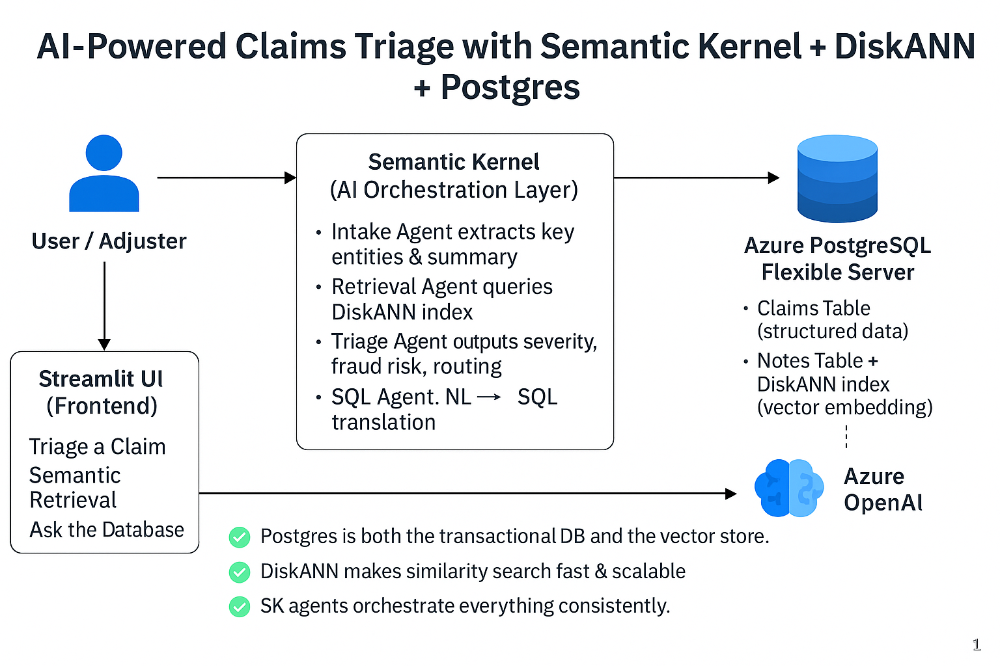

# SK + DiskANN Insurance Claims Demo

This project demonstrates how to integrate **Semantic Kernel (Python)** with **Azure PostgreSQL + DiskANN** vector search in a real-world scenario: **insurance claims triage + semantic retrieval of past cases**.

- **Agents (Semantic Kernel)**: IntakeAgent (normalize), TriageAgent (severity/fraud/route), SqlAgent (NL→SQL, SELECT-only)
- **Retrieval**: Fast ANN over embeddings using **pg_diskann** inside Azure PostgreSQL
- **UI**: Streamlit

## Quickstart

### 1) Prereqs
- Python 3.10+
- Azure OpenAI (chat + embedding deployments)
- Azure PostgreSQL Flexible Server with `pg_diskann`

### 2) Configure
```bash
cp config.sample.env .env
# edit .env with your values
```

### 3) Initialize DB + load data
```bash
psql "host=$PGHOST port=$PGPORT dbname=$PGDATABASE user=$PGUSER password=$PGPASSWORD sslmode=require" -f db/init.sql
python db/load_csv.py
python db/embed_notes.py
```

### 4) Run
```bash
python -m venv .venv && source .venv/bin/activate   # Windows: .venv\Scripts\activate
pip install -r requirements.txt
streamlit run app/streamlit_app.py
```
# Flow Diagram



See `demo_script.md` for a ≤5 min walkthrough.
